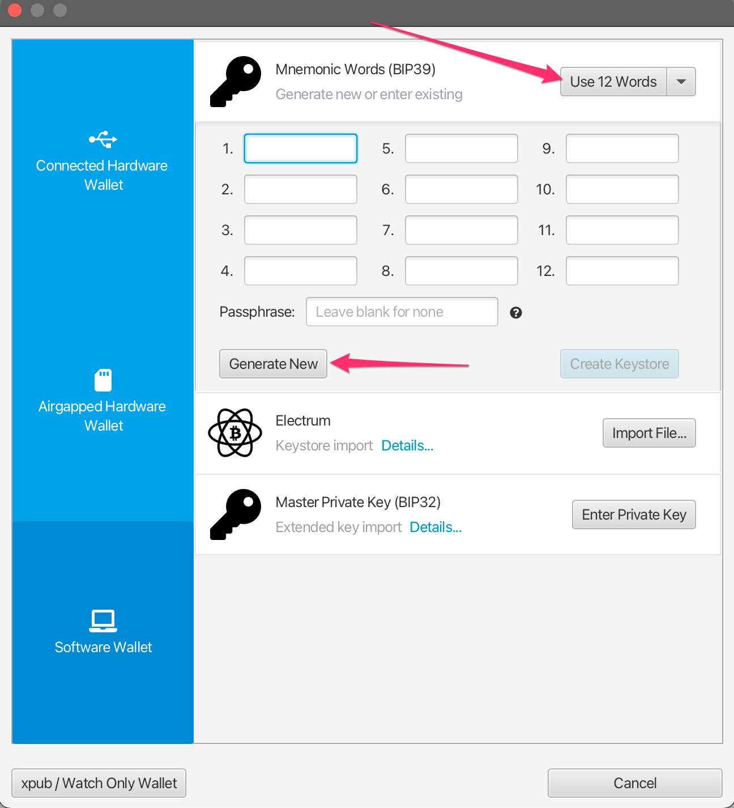
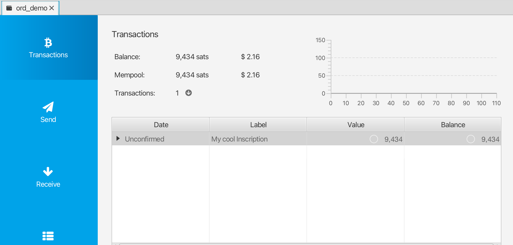
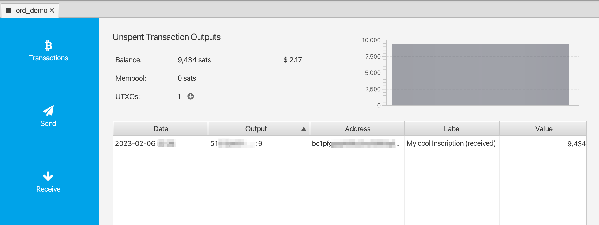
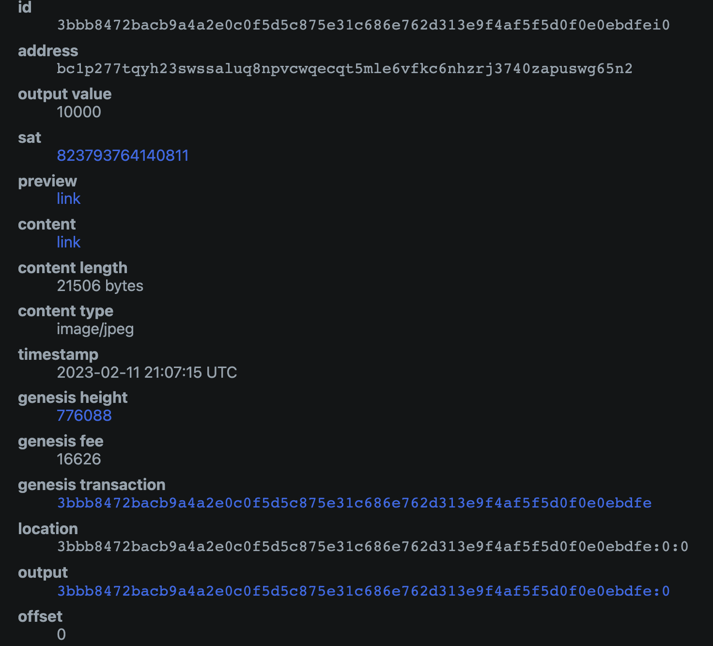
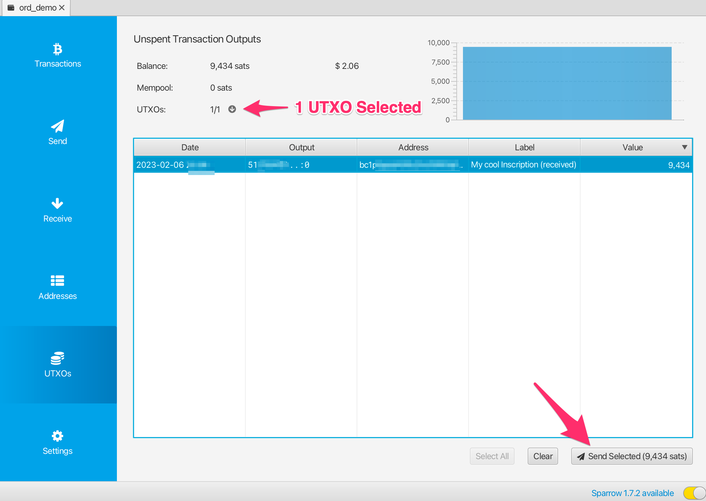
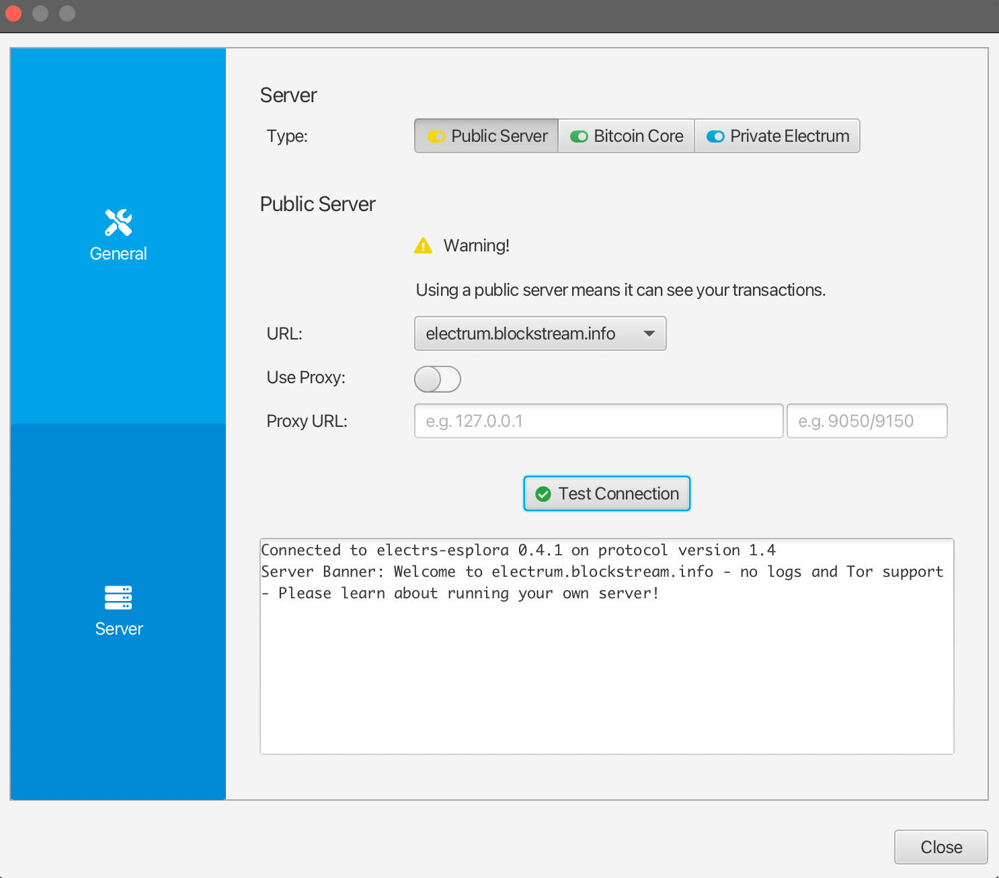

使用麻雀Sparrow钱包收藏铭文
=====================

那些无法活着尚未设置[ord](https://github.com/ordinals/ord) 钱包的用户可以使用其他比特币钱包接收铭文和序数，只要他们在使用该钱包时非常小心。

本指南提供了一些基本步骤，说明如何使用 [Sparrow Wallet](https://sparrowwallet.com/) 创建一个与`ord`兼容的钱包，稍后可以将其导入到`ord`

### ⚠️⚠️ 警告!! ⚠️⚠️

一般来说，如果你选择这种方法，你应该将这个钱包作为接收款项的钱包，使用Sparrow软件。

除非你确定知道自己在做什么，否则不要从这个钱包中花费任何比特币。如果你不注意这个警告，你可能会很容易无意间失去对序数和铭文的访问权限。

### 钱包设置和接收

根据你的操作系统从 [发布页面](https://sparrowwallet.com/download/) 下载Sparrow钱包。

选择 `File -> New Wallet`并创建一个名为`ord`的新钱包。

将`Script Type`更改为`Taproot (P2TR)`，然后选择`New or Imported Software Wallet`选项。

选择`Use 12 Words`，然后点击 `Generate New`。密码短语留空。

将为你生成一个新的12词BIP39种子短语。将此短语写在安全的地方，这是获取钱包访问权限的备份。切勿与他人分享或显示这个种子短语。

一旦你把种子短语写下来，点击 `Confirm Backup`.

重新输入你记下的种子短语，然后点击 `Create Keystore`.

点击 `Import Keystore`.

点击 `Apply`。如果你想的话，可以为钱包添加一个密码。

你现在有了一个兼容`ord`的钱包，可以使用BIP39种子短语导入到 `ord`。要接收序数或铭文，点击 `Receive`选项卡并复制一个新地址。

每次你想接收时，都应该使用一个全新的地址，而不是重复使用现有的地址。

注意，比特币与一些其他区块链钱包不同，这个钱包可以生成无限数量的新地址。你可以通过点击获取下一个地址按钮生成新地址。你可以在应用程序的`Addresses`选项卡中看到所有的地址。

你可以给每个地址添加一个标签，这样你就可以跟踪它的用途。

### 验证/查看收到的铭文

一旦你收到一条铭文，你将在 Sparrow 的 `Transactions` 选项卡中看到一个新的交易，以及在`UTXOs`选项卡中看到一个新的 UTXO。

最初，这笔交易可能有一个"未确认"的状态，你需要等待它被挖矿到一个比特币块中，才算真正收到。

要跟踪你的交易状态，你可以右键点击它，选择`Copy Transaction ID`，然后将该交易 id 粘贴到 [mempool.space](https://mempool.space)。

一旦交易被确认，你可以通过前往`UTXOs`选项卡，找到你想要检查的 UTXO，右键点击 `Output` 并选择 `Copy Transaction Output` 来验证和查看你的铭文。然后，这个交易输出 id 可以粘贴到 [ordinals.com](https://ordinals.com) 搜索。

### 冻结 UTXO

如上所述，你的每一条铭文都存储在一个未花费的交易输出 (UTXO) 中。你需要非常小心不要意外花费你的铭文，而冻结 UTXO 是使这种情况发生的难度增加的一种方式。

要做到这一点，去 UTXOs 选项卡，找到你想要冻结的 `UTXOs`，右键点击 `Output`  并选择`Freeze UTXO`。

这个 UTXO (铭文) 现在在 Sparrow 钱包中是不可消费的，直到你解冻它。

### 导入 `ord` 钱包

关于设置比特币核心和 `ord` 钱包的详细信息，请查看[铭文指南](../inscriptions.md)设置 `ord` 时，你可以使用 `ord wallet restore "BIP39 SEED PHRASE"` 命令和你用Sparrow Wallet生成的种子短语，导入你现有的钱包，而不是运行 `ord wallet create` 来创建一个全新的钱包。

目前存在一个[程序错误](https://github.com/ordinals/ord/issues/1589) 导致导入的钱包无法自动重新扫描区块链。为解决这个问题，你需要手动触发重新扫描，使用比特币核心命令行界面：

然后，你可以使用`ord wallet inscriptions`检查你的钱包的铭文.

注意，如果你之前已经用 `ord` 创建过一个钱包，那么你已经有一个默认名称的钱包，需要给你导入的钱包取一个不同的名称。你可以在所有的 `ord`命令中使用 `--wallet` 参数来引用不同的钱包，例如：

`ord --wallet ord_from_sparrow wallet restore "BIP39 SEED PHRASE"`

`ord --wallet ord_from_sparrow wallet inscriptions`

`bitcoin-cli -rpcwallet=ord_from_sparrow rescanblockchain 767430`

### 使用麻雀钱包发送铭文

#### ⚠️⚠️ 警告 ⚠️⚠️

虽然强烈建议你设置一个比特币核心节点并运行 `ord` 软件，但是你可以通过一些安全的方式在 Sparrow 钱包中发送铭文。请注意，这并不推荐，只有在你完全理解你正在做什么的情况下才能这么做。

使用 `ord` 软件将大大简化我们在这里描述的复杂性，因为它能以一种简单的方式自动并安全地处理发送铭文。

#### ⚠️⚠️ 额外警告 ⚠️⚠️

不要用你的sparrow麻雀铭文钱包去发送非铭文比特币。如果你需要进行普通的比特币交易，你可以在麻雀中设置一个单独的钱包，并保持你的铭文钱包独立。

#### 比特币的UTXO模型

在发送任何交易之前，你必须对比特币的未消费交易输出（UTXO）系统有一个良好的理解。比特币的工作方式与以太坊等许多其他区块链有着根本的不同。在以太坊中，通常你有一个存储ETH的单一地址，你无法区分其中的任何ETH - 它们只是该地址中的总金额的单一值。而比特币的工作方式完全不同，我们为每个接收生成一个新地址，每次你向钱包中的一个地址接收sats时，你都在创建一个新的UTXO。每个UTXO都可以单独查看和管理。你可以选择想要花费的特定UTXO，也可以选择不花费某些UTXO。

有些比特币钱包并不显示这个级别的详细信息，它们只向你显示钱包中所有比特币的单一总和值。然而，当发送铭文时，使用如麻雀这样允许UTXO控制的钱包非常重要。

#### 在发送之前检查你的铭文

如我们之前所述，铭文是刻在聪上的，sats存储在UTXO中。UTXO是具有某个特定数量的satoshi（输出值）的satoshi集合。通常（但不总是）铭文会被刻在UTXO中的第一个satoshi上。

在发送前检查你的铭文时，你主要要检查的是你的铭文刻在UTXO中的哪个satoshi上。

为此，你可以按照上述 [验证/查看收到的铭文](./sparrow-wallet.md#validating--viewing-received-inscriptions)来找到ordinals.com上你的铭文的铭文页面。

在那里，你会找到一些关于你铭文的元数据，如下所示：

以下是需要检查的几个重要事项：
* `output` 标识符与您将要发送的UTXO的标识符匹配
* 铭文的`offset`是 `0` (这意味着铭文位于UTXO的第一个sat上)
* `output_value` 有足够的sats来支付发送交易的交易费（邮资），您需要的确切金额取
决于您为交易选择的费率

如果以上所有内容对于您的铭文都是正确的，那么您应该可以安全地使用以下方法发送它。

⚠️⚠️ 发送铭文时要非常小心，特别是如果`offset` 值不是`0`。如果是这种情况，不建议使用这种方法，否则您可能会无意中将您的雕文发送给比特币矿工，除非您知道自己在做什么。

#### 发送您的铭文

要发送铭文，请导航到`UTXOs`选项卡，并找到您之前验证包含您的雕文的UTXO。

如果您之前冻结了UXTO，您将需要右键单击它并解冻它。

选择您想要发送的UTXO，并确保这是唯一选中的UTXO。在界面中，您应该看到`UTXOs 1/1`。确定这个后，您可以点击`Send Selected`。

然后，您将看到交易构建界面。在这里，您需要检查几件事以确保这是一个安全的发送：

- 交易应该只有1个输入，这应该是您想要发送的带有标签的UTXO
- 交易应该只有1个输出，这是您想要发送铭文的地址/标签

如果您的交易看起来与此不同，例如您有多个输入或多个输出，那么这可能不是一种安全的铭文传输方式，您应该放弃发送，直到您更了解或可以导入到`ord`钱包。

您应该设置合适的交易费用，Sparrow通常会推荐一个合理的费用，但您也可以查看[mempool.space](https://mempool.space) 以查看发送交易的推荐费率。

您应该为收件人地址添加一个标签，如`alice address for inscription #123`就很理想。

在使用上述检查确认交易是安全的交易，并且有信心发送它后，您可以点击`Create Transaction`。

在这里，您可以再次确认您的交易是否安全，在确认后，您可以点击`Finalize Transaction for Signing`。

在这里，你可以在点击`Sign`之前再次确认所有内容。

然后实际上在点击`Broadcast Transaction`之前，你有最后一次检查所有内容的机会。一旦你广播交易，它就会被发送到比特币网络，并开始在mempool中传播。

如果你想跟踪你的交易状态，你可以复制`Transaction Id (Txid)`并粘贴到[mempool.space](https://mempool.space)一旦交易确认，你可以在[ordinals.com](https://ordinals.com) 的铭文页面上验证它是否已移动到新的输出位置和地址。

### 故障排除

Sparrow钱包没有显示交易/UTXO，但我在mempool.space上看到了确保你的钱包连接到一个比特币节点。要验证这一点，转到`Preferences`-> `Server` 设置，并点击 `Edit Existing Connection`。

从那里你可以选择一个节点并点击 `Test Connection` 来验证Sparrow是否能够成功连接。

